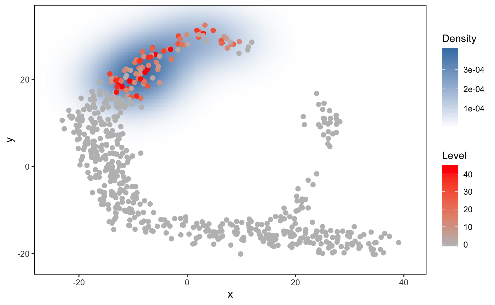
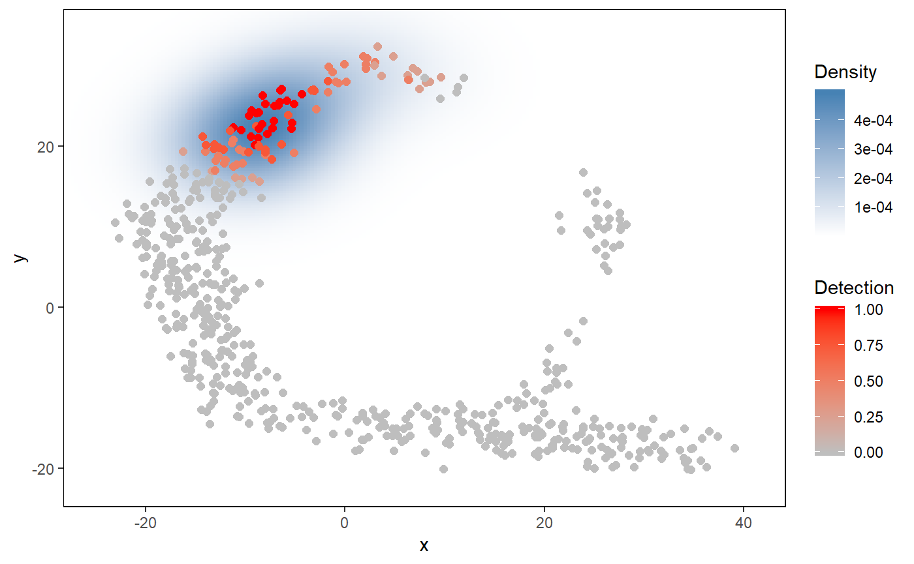

<!-- README.md is generated from README.Rmd. Please edit that file -->

# singleCellHaystack

`singleCellHaystack` is a package for finding surprising needles
(=genes) in haystacks (=single cell transcriptome data). Single-cell
RNA-seq (scRNA-seq) data is often converted to fewer dimensions using
Principal Component Analysis (PCA) and represented in 2-dimentional
plots (e.g. t-SNE or UMAP plots). `singleCellHaystack` can be used for
finding genes that are expressed in subsets of cells that are
non-randomly distributed in these multi-dimensional spaces or 2D
representations.

Our manuscript about `singleCellHaystack` is now availabe on
[bioRxiv](https://www.biorxiv.org/content/10.1101/557967v1).

## Installation

<!-- You can install the released version of singleCellHaystack from [CRAN](https://CRAN.R-project.org) with: -->

<!-- ``` r -->

<!-- install.packages("singleCellHaystack") -->

<!-- ``` -->

You can install the `singleCellHaystack` from the GitHub repository as
follows:

``` r
remotes::install_github("alexisvdb/singleCellHaystack")
```

## Example usage

A small toy dataset is included in the package. The toy dataset
includes:

  - `dat.expression`: scRNA-seq expression of genes (rows) in cells
    (columns)

  - `dat.tsne`: a 2D representation of the cell in dat.expression

First, apply `haystack` (the main function of the package) on the toy
dataset.

``` r
library(singleCellHaystack)
set.seed(1234)

# Turn the expression data into detection (gene detected = TRUE, not detected = FALSE)
dat.detection <- dat.expression > 1

# run the main 'haystack' analysis
res <- haystack(dat.tsne, detection=dat.detection, method = "2D")
#> ### calling haystack_2D()...
#> ### setting parameters...
#> ### calculating Kullback-Leibler divergences...
#> ### starting randomizations...
#> ### ... 10 values out of 58 done
#> ### ... 20 values out of 58 done
#> ### ... 30 values out of 58 done
#> ### ... 40 values out of 58 done
#> ### ... 50 values out of 58 done
#> ### estimating p-values...
#> ### returning result...

# the returned results 'res' is of class 'haystack'
class(res)
#> [1] "haystack"
```

Let’s have a look at the “most surprising” genes.

``` r
# show top 10 "surprising" genes
show_result_haystack(res.haystack = res, n=10)
#>              D_KL log.p.vals T.counts
#> gene_242 1.360661  -21.57548       96
#> gene_275 1.345251  -20.97236       95
#> gene_317 1.386194  -20.94379       94
#> gene_497 1.599646  -20.46697       86
#> gene_79  1.929800  -20.43333       68
#> gene_244 1.238011  -19.91416       95
#> gene_351 1.408946  -19.57361       89
#> gene_339 1.414814  -19.17568       87
#> gene_62  1.519993  -19.06512       81
#> gene_137 1.349994  -19.05803       89

# alternatively: use a p-value threshold
#show_result_haystack(res.haystack = res, p.value.threshold = 1e-10)
```

One of the most non-random genes is “gene\_497”. Here we visualize it’s
expression in the t-SNE plot.

``` r
# visualize one of the surprizing genes
plot_gene_haystack(dat.tsne, expression=dat.expression, 
                      gene="gene_497", detection = dat.detection, high.resolution = TRUE, point.size=2)
```

 Yes, the
pattern of cells in the toy example roughly resembles a haystack; see
[the Haystack paintings by
Monet](https://en.wikipedia.org/wiki/Haystacks_\(Monet_series\)).

You are not limited to single genes. Here, we pick up a set of
non-random genes, and group them by their expression pattern in the plot
into 5
clusters.

``` r
# get the top most significant genes, and cluster them by their distribution pattern in the 2D plot
sorted.table <- show_result_haystack(res.haystack = res, p.value.threshold = 1e-10)
gene.subset <- row.names(sorted.table)

# k-means clustering
km <- kmeans_haystack(x=dat.tsne, detection=dat.detection, genes=gene.subset, k=5)
km.clusters <- km$cluster

# alternatively: hierarchical clustering
#hc <- hclust_haystack(x=dat.tsne$tSNE1, y=dat.tsne$tSNE2, detection=dat.detection, genes=gene.subset)
#hc.clusters <- cutree(hc,k = 5)
```

… and visualize the average pattern of the genes in cluster 1 (for
example).

``` r
# visualize cluster distributions
plot_gene_set_haystack(x=dat.tsne, detection=dat.detection, 
                          genes=names(km.clusters[km.clusters==1]), point.size=2)
```


