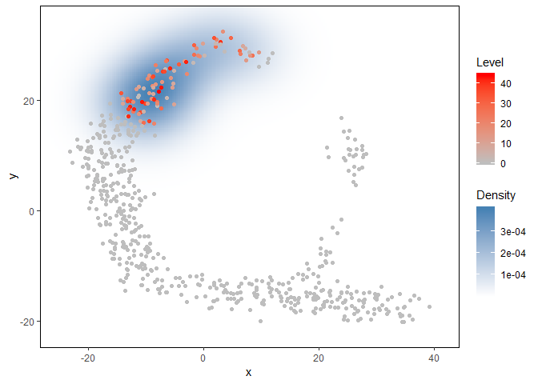
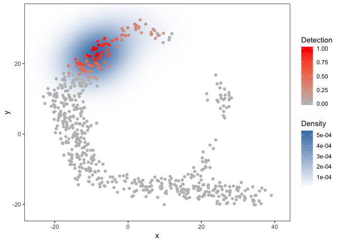

<!-- README.md is generated from README.Rmd. Please edit that file -->

# singleCellHaystack

The goal of singleCellHaystack is to …

## Installation

You can install the released version of singleCellHaystack from
[CRAN](https://CRAN.R-project.org) with:

``` r
install.packages("singleCellHaystack")
```

## Introduction

‘haystack’ is a package for finding surprising needles (=genes) in
haystacks (=2D representations of single cell transcriptome data).
Single-cell RNA-seq (scRNA-seq) data is often represented in
2-dimentional plots (e.g. plots of two principal components, or t-SNE
plots). ‘haystack’ can be used for finding genes that are expressed in
subsets of cells that are non-randomly distributed in this 2D
representation.

## Example usage

A small toy dataset is included in the package. The toy dataset
includes:

  - ‘dat.expression’: scRNA-seq expression of genes (rows) in cells
    (columns)

  - ‘dat.tsne’: a 2D representation of the cell in dat.expression

<!-- end list -->

``` r
library(singleCellHaystack)

# Turn the expression data into detection (gene detected = T, not detected = F)
dat.detection <- dat.expression > 1

# run the main 'haystack' analysis
res <- haystack(x=dat.tsne$tSNE1, y=dat.tsne$tSNE2, detection=dat.detection)
#> ### setting parameters...
#> ### calculating Kulback-Leibler divergences...
#> ### starting randomizations...
#> ### ... 10 values out of 58 done
#> ### ... 20 values out of 58 done
#> ### ... 30 values out of 58 done
#> ### ... 40 values out of 58 done
#> ### ... 50 values out of 58 done
#> ### estimating p-values...
#> ### returning result...

# the returned results 'res' is of class 'haystack'
class(res)
#> [1] "haystack"
## [1] "haystack"

# show top 10 "surprising" genes
show_result_haystack(res.haystack = res, n=10)
#>              D_KL log.p.vals T.counts
#> gene_497 1.599646  -23.96215       86
#> gene_62  1.519993  -23.34565       81
#> gene_61  1.470475  -22.69847       80
#> gene_339 1.414814  -22.03340       87
#> gene_79  1.929800  -21.34321       68
#> gene_351 1.408946  -21.30571       89
#> gene_444 1.435882  -20.79259       75
#> gene_137 1.349994  -20.75643       89
#> gene_313 1.294544  -20.45329       78
#> gene_325 1.209385  -20.37269       84

# alternatively: use a p-value threshold
#show_result_haystack(res.haystack = res, p.value.threshold = 1e-10)

# visualize one of the surprizing genes
plot_gene_haystack(x=dat.tsne$tSNE1, y=dat.tsne$tSNE2, expression=dat.expression, 
                      gene="gene_11", detection = dat.detection, high.resolution = TRUE)
```



``` r

# get the top most significant genes, and cluster them by their distribution pattern in the 2D plot
sorted.table <- show_result_haystack(res.haystack = res, p.value.threshold = 1e-10)
gene.subset <- row.names(sorted.table)

# k-means clustering
km <- kmeans_haystack(x=dat.tsne$tSNE1, y=dat.tsne$tSNE2, detection=dat.detection, genes=gene.subset, k=5)
km.clusters <- km$cluster

# alternatively: hierarchical clustering
#hc <- hclust_haystack(x=dat.tsne$tSNE1, y=dat.tsne$tSNE2, detection=dat.detection, genes=gene.subset)
#hc.clusters <- cutree(hc,k = 5)

# visualize cluster distributions
plot_gene_set_haystack(x=dat.tsne$tSNE1, y=dat.tsne$tSNE2, detection=dat.detection, 
                          genes=names(km.clusters[km.clusters==1]))
```


