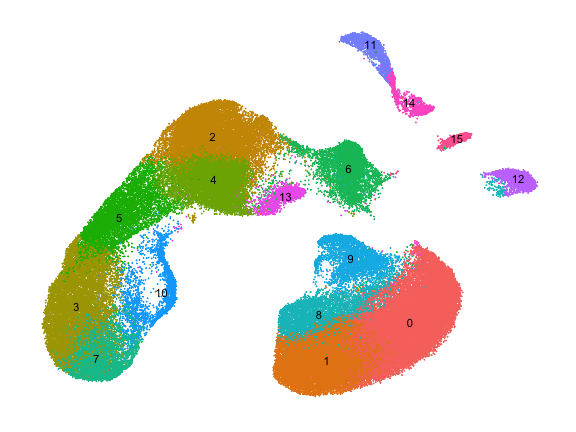
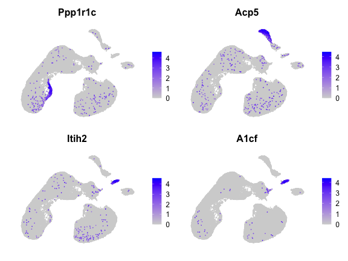

# Load data

Here we apply `haystack` to 100k cells from the Mouse Organogenesis Cell Atlas (MOCA). The sparse matrix data was downloaded from the [MOCA website](https://oncoscape.v3.sttrcancer.org/atlas.gs.washington.edu.mouse.rna/landing). The data was converted into a Seurat object and processed following the [standard pipeline](https://satijalab.org/seurat/v3.2/pbmc3k_tutorial.html).


```r
library(here)
library(Seurat)
library(singleCellHaystack)
```


```r
x <- readRDS(here("data-raw/data/moca_100k.rds"))
x
```

```
## An object of class Seurat 
## 16811 features across 100000 samples within 1 assay 
## Active assay: RNA (16811 features, 2000 variable features)
##  2 dimensional reductions calculated: pca, umap
```


```r
DimPlot(x, label = TRUE) + NoLegend() + NoAxes()
```



# Haystack

We run `haystack` using PCA coordinates with 50 PCs.


```r
system.time({
  res <- haystack(x, coord="pca")
})
```


```
##    user  system elapsed 
## 256.045  28.569 284.612
```

It takes around 5 minutes to complete in a standard personal computer. Here we show the top 10 genes selected by `haystack`.


```r
top <- show_result_haystack(res)
head(top, n=10)
```

```
##               D_KL log.p.vals log.p.adj
## Ppp1r1c 0.25684566  -202.6767 -198.4511
## Acp5    0.13324559  -173.9745 -169.7489
## Itih2   0.19905815  -168.2541 -164.0285
## A1cf    0.27878610  -161.4285 -157.2029
## Kel     0.08720005  -158.6047 -154.3791
## Rhag    0.08512571  -157.6347 -153.4091
## Ermap   0.08432139  -157.2455 -153.0199
## Pkhd1l1 0.09157942  -156.9557 -152.7301
## Spta1   0.08178285  -155.5603 -151.3347
## Gm43449 0.16349201  -155.3943 -151.1687
```

And here we plot the expression of the top 4 genes.


```r
FeaturePlot(x, head(rownames(top), 4), order=TRUE) & NoAxes()
```


