# Load data

Here we apply `haystack` to find genes changing along a differentiation trajectory. For this we use the Tabula Muris thymus dataset that can be downloaded from [figshare](https://figshare.com/ndownloader/files/13090580).


The data was converted into a Seurat object and processed following the [standard pipeline](https://satijalab.org/seurat/v3.2/pbmc3k_tutorial.html).


```r
library(here)
library(ggplot2)
library(dplyr)
library(tidyr)
library(Seurat)
library(SeuratWrappers)
library(monocle3)
library(ComplexHeatmap)
library(singleCellHaystack)

theme_set(cowplot::theme_cowplot())

set.seed(1)
```


```r
load(here("data-raw/data/droplet_Thymus_seurat_tiss.Robj"))
tiss <- UpdateSeuratObject(tiss)
```

We will calculate trajectories with monocle3, so we need to compute UMAP. We recalculate variable features and PCA to obtain a suitable UMAP plot.


```r
tiss <- FindVariableFeatures(tiss, nfeatures=5000)
tiss <- RunPCA(tiss, verbose=FALSE)
ElbowPlot(tiss, ndims=50)
```

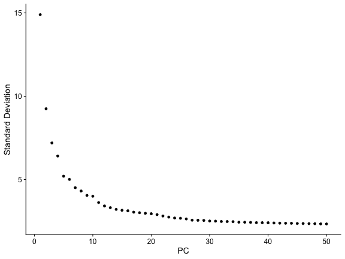


```r
tiss <- RunUMAP(tiss, dims=1:30)
```


```r
DimPlot(tiss, label=TRUE) + NoLegend() + NoAxes()
```

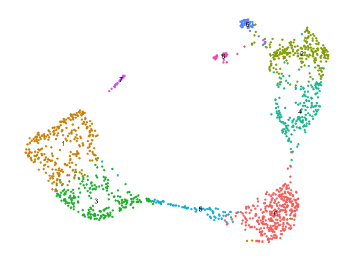

# Monocle3

We use the SeuratWrappers package to convert our Seurat object into a CellDataSet object used by monocle3.


```r
cds <- SeuratWrappers::as.cell_data_set(tiss)
cds
```

```
## class: cell_data_set 
## dim: 23341 1429 
## metadata(0):
## assays(3): counts logcounts scaledata
## rownames(23341): Xkr4 Rp1 ... Tdtom-transgene zsGreen-transgene
## rowData names(0):
## colnames(1429): 10X_P7_11_AAACCTGAGACAGGCT 10X_P7_11_AAACCTGAGAGTCTGG ... 10X_P7_11_TTTGGTTTCCTAGGGC
##   10X_P7_11_TTTGTCATCGAACTGT
## colData names(17): orig.ident channel ... ident Size_Factor
## reducedDimNames(3): PCA TSNE UMAP
## mainExpName: RNA
## altExpNames(0):
```

We need to re-calculate clusters to obtain also partitions.


```r
cds <- cluster_cells(cds)
plot_cells(cds)
```

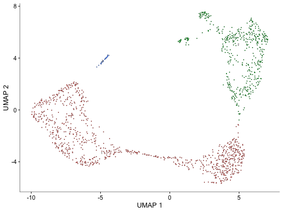

```r
plot_cells(cds, color_cells_by="partition")
```

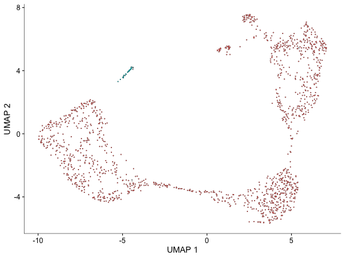

Then learn a trajectory graph.


```r
cds <- learn_graph(cds)
```

```
## 
  |                                                                                                                                 
  |                                                                                                                           |   0%
  |                                                                                                                                 
  |===========================================================================================================================| 100%
```

```r
plot_cells(cds, label_principal_points=TRUE)
```

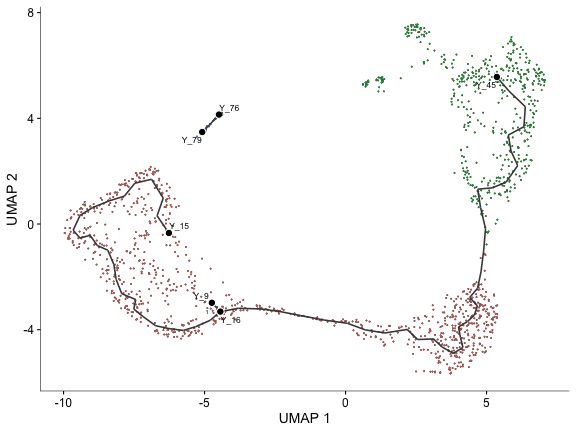

And order cells along the graph choosing a suitable starting point (node).


```r
cds <- order_cells(cds, root_pr_nodes="Y_15")
plot_cells(cds, color_cells_by="pseudotime")
```

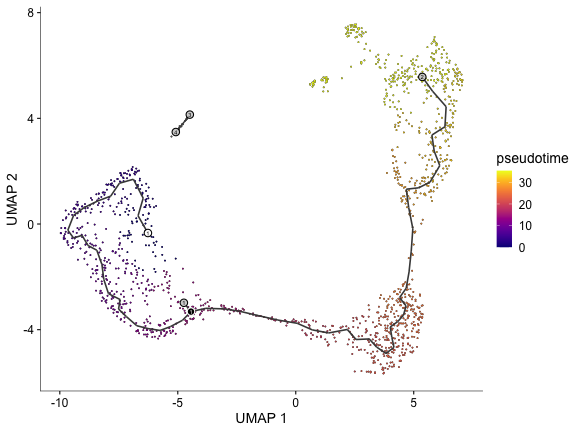

Select a trajectory from the graph by choosing starting and end nodes.


```r
sel.good.cells <- ! is.infinite(pseudotime(cds))
cells <- colnames(choose_graph_segments(cds[, sel.good.cells], starting_pr_node="Y_15", ending_pr_nodes="Y_45"))
plot_cells(cds[, cells], color_cells_by="pseudotime")
```

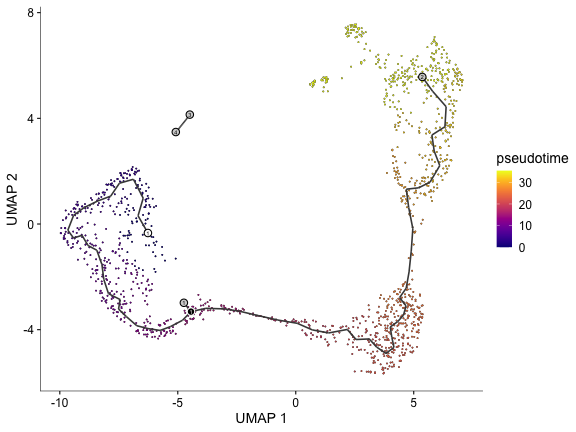

We plot the expression of some markers for T cell development along the pseudotime.


```r
genes <- c("Cd3d", "Cd4", "Cd8a", "Cd2", "Mki67", "Cd28")
d <- data.frame(pseudotime=monocle3::pseudotime(cds))
d <- cbind(d, t(GetAssayData(tiss)[genes, ]))
d <- d |> dplyr::filter(is.finite(pseudotime))
lapply(genes, function(gene) {
  ggplot(d |> dplyr::filter(.data[[gene]] > 0), aes(pseudotime, .data[[gene]])) +
    geom_point() +
    geom_smooth(method="lm", formula=y~ splines::ns(x, df=3), se=FALSE, color="violetred", linewidth=1)
}) |> patchwork::wrap_plots()
```

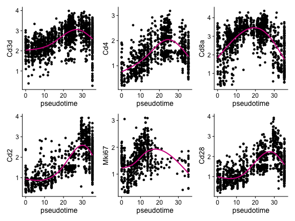

# Haystack

Now we run haystack using the pseudotime as coordinates. For convenience we store the pseudotime as an embedding in the Seurat object.


```r
pseudotime <- matrix(pseudotime(cds), ncol=1)
colnames(pseudotime) <- "pseudotime_1"
rownames(pseudotime) <- colnames(cds)
tiss[["pseudotime"]] <- SeuratObject::CreateDimReducObject(pseudotime, assay="RNA")
tiss
```

```
## An object of class Seurat 
## 23341 features across 1429 samples within 1 assay 
## Active assay: RNA (23341 features, 5000 variable features)
##  4 dimensional reductions calculated: pca, tsne, umap, pseudotime
```

Filter cells without valid pseudotime.


```r
sel.inf <- is.infinite(Embeddings(tiss, "pseudotime")[, 1])
table(sel.inf)
```

```
## sel.inf
## FALSE  TRUE 
##  1399    30
```


```r
cells <- intersect(cells, colnames(tiss)[!sel.inf])
```

Then run haystack on the pseudotime embedding.


```r
system.time({
  res <- haystack(tiss[, cells], coord="pseudotime")
})
```

```
##    user  system elapsed 
##   5.509   2.184   7.962
```

Check that the KL_D fitting parameters look fine.


```r
plot_rand_fit(res, "mean")
```

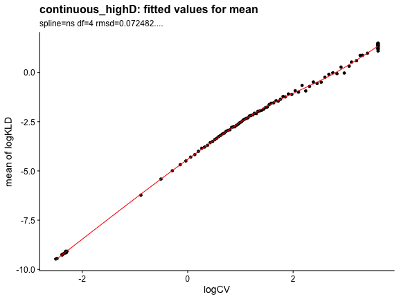

```r
plot_rand_fit(res, "sd")
```

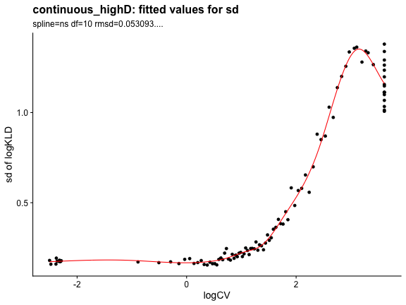

We obtain the results, sorted by log.p.vals.


```r
sum <- show_result_haystack(res)
head(sum)
```

```
##             D_KL log.p.vals log.p.adj
## Endou  0.6642159  -157.9285 -153.7925
## Dntt   0.4179792  -144.7295 -140.5934
## Arpp21 0.6291999  -143.4789 -139.3429
## Aqp11  0.6940650  -124.6806 -120.5445
## Rag1   0.7321180  -121.5653 -117.4293
## Mns1   0.7646233  -117.3909 -113.2549
```

The distribution of p.values shows strong evidence of genes changing along the trajectory.


```r
ggplot(sum, aes(10^log.p.vals)) +
  geom_histogram()
```

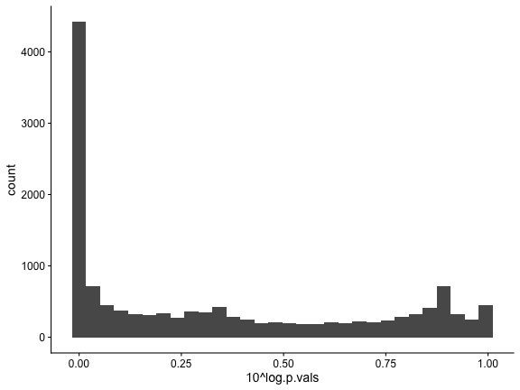

Approximately 1,000 genes could be DEGs.


```r
d <- data.frame(index=seq_along(rownames(sum)), log.p.val=sum$log.p.vals)
ggplot(d, aes(index, log.p.val)) + geom_point() +
  geom_vline(xintercept=1000, color="red")
```

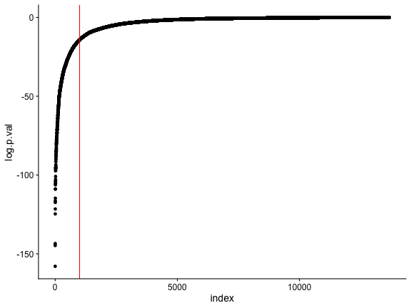

We check the top 500.


```r
top <- head(sum, n=500)
head(top)
```

```
##             D_KL log.p.vals log.p.adj
## Endou  0.6642159  -157.9285 -153.7925
## Dntt   0.4179792  -144.7295 -140.5934
## Arpp21 0.6291999  -143.4789 -139.3429
## Aqp11  0.6940650  -124.6806 -120.5445
## Rag1   0.7321180  -121.5653 -117.4293
## Mns1   0.7646233  -117.3909 -113.2549
```

And visualize the expression of genes along the pseudotime axis in a heatmap. For the top 100 we show the gene names.


```r
pseudotime <- Embeddings(tiss, reduction="pseudotime")[, 1]
sel.ok <- is.finite(pseudotime)
pseudotime <- pseudotime[sel.ok]
exprs <- as.matrix(GetAssayData(tiss)[, sel.ok])

exprs <- exprs[rownames(top), order(pseudotime)]
pseudotime <- pseudotime[order(pseudotime)]

r <- range(pseudotime, na.rm=TRUE)
pseudo_color <- circlize::colorRamp2(seq(r[1], r[2], length.out=5), viridis::magma(5))
top_ann <- ComplexHeatmap::columnAnnotation(df=data.frame(pseudotime=pseudotime), col=list(pseudotime=pseudo_color), show_legend=FALSE)

ComplexHeatmap::Heatmap(exprs, show_column_names=FALSE, show_row_names=FALSE, cluster_columns=FALSE, name="expression", top_annotation=top_ann)
```

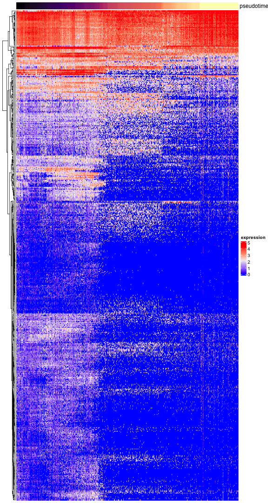

```r
top_100 <- head(rownames(top), n=100)
ComplexHeatmap::Heatmap(exprs[top_100, ], show_column_names=FALSE, show_row_names=TRUE, cluster_columns=FALSE, name="expression", top_annotation=top_ann)
```

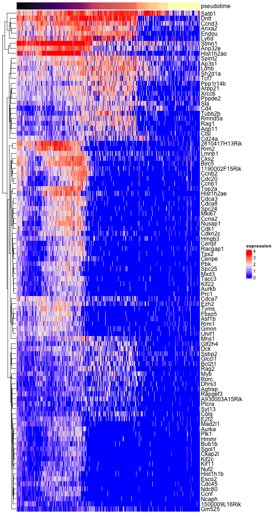
