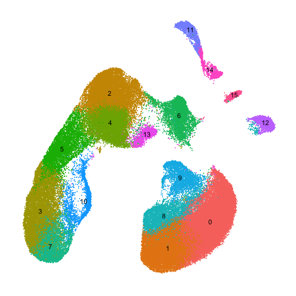
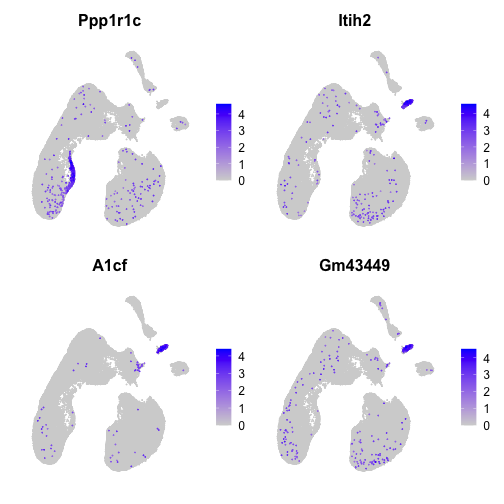

# Load data

Here we apply `haystack` to 100k cells from the Mouse Organogenesis Cell Atlas (MOCA). The sparse matrix data was downloaded from the [MOCA website](https://oncoscape.v3.sttrcancer.org/atlas.gs.washington.edu.mouse.rna/landing). The data was converted into a Seurat object and processed following the [standard pipeline](https://satijalab.org/seurat/v3.2/pbmc3k_tutorial.html).


```r
library(here)
library(tidyverse)
library(Seurat)
library(singleCellHaystack)
library(scmisc)
```


```r
x <- read_rds(here("data-raw/moca_100k.rds"))
x
```

```
## An object of class Seurat 
## 16811 features across 100000 samples within 1 assay 
## Active assay: RNA (16811 features, 2000 variable features)
##  2 dimensional reductions calculated: pca, umap
```


```r
DimPlot(x, label = TRUE) + NoLegend() + NoAxes()
```


 
 
# Haystack

We run `haystack` using the method _highD_ with the default threshold for detection, which is more than 1.


```r
system.time({
  res <- haystack(x, method = "highD")
})
```


```
##     user   system  elapsed 
## 2397.740  480.219 2878.232
```


It takes 48 minutes to complete in a standard personal computer. Here we show the top 10 genes selected by `haystack`.


```r
top <- show_result_haystack(res, n = 10)
top
```

```
##               D_KL log.p.vals log.p.adj T.counts
## Ppp1r1c 0.17135507  -176.2468 -172.0212     1041
## Itih2   0.17876325  -172.0384 -167.8128      634
## A1cf    0.27125529  -168.8895 -164.6639      418
## Gm43449 0.15025195  -161.1296 -156.9040      585
## Fyb     0.14040878  -158.3336 -154.1080      590
## Apob    0.15036594  -157.6220 -153.3965      539
## Trim55  0.12758730  -156.5981 -152.3725      640
## Inpp5d  0.10239601  -152.3932 -148.1676      881
## Abcc2   0.23483323  -150.4938 -146.2682      359
## Cdh19   0.09594113  -149.7875 -145.5619      903
```

And here we plot the expression of the top 4 genes.


```r
FeaturePlot(x, rownames(top)[1:4], order = TRUE) & NoAxes()
```




